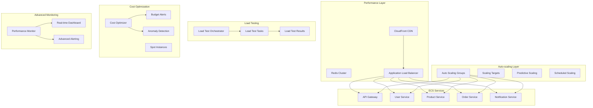

# Phase 7: Advanced Features & Performance Optimization

## 🚀 Tổng Quan

Phase 7 triển khai các tính năng nâng cao và tối ưu hóa hiệu suất cho hệ thống Django Microservices trên AWS ECS Fargate. Giai đoạn này tập trung vào việc nâng cao khả năng mở rộng, hiệu suất, và tối ưu hóa chi phí.

## 🎯 Mục Tiêu

- **Advanced Auto-scaling**: Triển khai auto-scaling thông minh với predictive scaling
- **Performance Optimization**: Tối ưu hóa hiệu suất với CloudFront, Redis clustering, và performance monitoring
- **Load Testing**: Hạ tầng load testing tự động với ECS và Lambda
- **Cost Optimization**: Phân tích và tối ưu hóa chi phí với spot instances và scheduled scaling
- **Advanced Monitoring**: Giám sát nâng cao với dashboard real-time và alerting thông minh

## 📋 Kiến Trúc Tổng Thể



## 🔧 Thành Phần Chính

### 1. Advanced Auto-scaling (`autoscaling-advanced.tf`)

#### Tính năng:
- **Target Tracking Scaling**: CPU, Memory, Request count based scaling
- **Step Scaling**: Aggressive scaling với multiple thresholds
- **Predictive Scaling**: ML-based predictive scaling
- **Scheduled Scaling**: Scheduled scaling cho predictable workloads
- **Custom Metrics**: Application-specific scaling metrics

#### Cấu hình:
```hcl
# Auto-scaling targets
autoscaling_min_capacity = 1
autoscaling_max_capacity = 10
autoscaling_cpu_target = 70
autoscaling_memory_target = 70
autoscaling_request_target = 1000

# Advanced features
enable_predictive_scaling = true
enable_scheduled_scaling = true
scale_up_schedule = "cron(0 8 * * MON-FRI *)"
scale_down_schedule = "cron(0 20 * * MON-FRI *)"
```

### 2. Performance Optimization (`performance.tf`)

#### CloudFront CDN:
- **Global Content Delivery**: Cached content delivery
- **API Acceleration**: Optimized API responses
- **Static Content**: Aggressive caching cho static files
- **Compression**: Automatic content compression

#### Redis Cluster:
- **Multi-AZ Deployment**: High availability caching
- **Encryption**: At-rest và in-transit encryption
- **Performance Insights**: Slow query logging
- **Automatic Failover**: Redis cluster failover

#### Performance Monitoring:
- **Lambda Monitor**: Real-time performance analysis
- **Automated Recommendations**: Performance optimization suggestions
- **Metric Collection**: Comprehensive metrics collection
- **Alert Integration**: SNS-based alerting

### 3. Load Testing Infrastructure (`load-testing.tf`)

#### ECS Load Testing:
- **Locust Integration**: Web-based load testing
- **Scalable Testing**: ECS Fargate-based testing
- **Test Orchestration**: Lambda-based test management
- **Result Storage**: S3-based result storage

#### API Gateway Control:
- **REST API**: Load test control interface
- **Test Management**: Start, stop, status, results
- **Real-time Monitoring**: Test progress monitoring

#### Usage Example:
```bash
# Start load test
curl -X POST https://api-gateway-url/loadtest \
  -d '{"action": "run", "target_rps": 100, "duration": 10}'

# Check status
curl -X POST https://api-gateway-url/loadtest \
  -d '{"action": "status"}'

# Stop test
curl -X POST https://api-gateway-url/loadtest \
  -d '{"action": "stop"}'
```

### 4. Cost Optimization (`cost-optimization.tf`)

#### Spot Fleet:
- **Cost Savings**: Up to 90% savings with spot instances
- **Multi-Instance Types**: Flexible instance selection
- **Automatic Replacement**: Spot interruption handling

#### Cost Monitoring:
- **Usage Analysis**: AWS Cost Explorer integration
- **Anomaly Detection**: Unusual cost pattern detection
- **Budget Alerts**: Cost threshold notifications
- **Recommendations**: Cost optimization suggestions

#### S3 Lifecycle:
- **Intelligent Tiering**: Automatic storage class transitions
- **Cost Optimization**: Reduced storage costs
- **Retention Policy**: Automated data retention

### 5. Advanced Management (`phase7-manager.py`)

#### Features:
- **Interactive Dashboard**: Real-time monitoring interface
- **Performance Analysis**: Comprehensive performance metrics
- **Load Test Management**: Integrated load testing controls
- **Cost Analysis**: Cost optimization recommendations
- **Health Monitoring**: Service health scoring

#### Usage:
```bash
# Install dependencies
pip install boto3 tabulate colorama requests

# Run manager
python phase7-manager.py --project django-microservices --environment dev
```

## 🛠️ Cài Đặt và Triển Khai

### 1. Cập nhật Variables
```bash
# Edit terraform/variables.tf
vim terraform/variables.tf
```

### 2. Triển khai Infrastructure
```bash
cd terraform/

# Initialize với advanced features
terraform init

# Plan với advanced features
terraform plan -var="enable_performance_mode=true" \
              -var="enable_load_testing=true" \
              -var="enable_predictive_scaling=true" \
              -var="enable_scheduled_scaling=true"

# Apply
terraform apply
```

### 3. Cấu hình Performance Features
```bash
# Enable CloudFront
terraform apply -var="enable_performance_mode=true"

# Configure Redis cluster
terraform apply -var="redis_node_type=cache.t3.micro"
```

### 4. Setup Load Testing
```bash
# Enable load testing
terraform apply -var="enable_load_testing=true"

# Configure test parameters
terraform apply -var="load_test_target_rps=100" \
              -var="load_test_duration=10"
```

## 📊 Monitoring và Alerting

### 1. CloudWatch Dashboards
- **Auto-scaling Dashboard**: Task count, CPU, Memory metrics
- **Performance Dashboard**: Response time, error rates, throughput
- **Load Test Dashboard**: Test progress, application performance
- **Cost Dashboard**: Usage patterns, cost trends

### 2. SNS Notifications
- **Performance Alerts**: High resource utilization
- **Cost Alerts**: Budget thresholds
- **Load Test Alerts**: Test completion notifications
- **System Health**: Service health changes

### 3. Custom Metrics
```python
# Example: Custom application metrics
import boto3

cloudwatch = boto3.client('cloudwatch')

# Put custom metric
cloudwatch.put_metric_data(
    Namespace='MyApp/Performance',
    MetricData=[
        {
            'MetricName': 'OrderProcessingTime',
            'Value': 1.5,
            'Unit': 'Seconds',
            'Dimensions': [
                {
                    'Name': 'Service',
                    'Value': 'order-service'
                }
            ]
        }
    ]
)
```

## 🧪 Load Testing

### 1. Locust Configuration
```python
# locustfile.py
from locust import HttpUser, task, between

class WebsiteUser(HttpUser):
    wait_time = between(1, 3)
    
    @task(3)
    def view_products(self):
        self.client.get("/api/products/")
    
    @task(1)
    def create_order(self):
        self.client.post("/api/orders/", json={
            "product_id": 1,
            "quantity": 2
        })
```

### 2. Test Scenarios
```bash
# Light load test
./run_load_test.sh --users 50 --spawn-rate 5 --duration 5m

# Stress test
./run_load_test.sh --users 500 --spawn-rate 50 --duration 15m

# Spike test
./run_load_test.sh --users 1000 --spawn-rate 100 --duration 2m
```

## 💰 Cost Optimization

### 1. Spot Instance Strategy
```hcl
# Spot fleet configuration
spot_fleet_request {
  allocation_strategy = "lowestPrice"
  target_capacity = 2
  spot_price = "0.05"
  
  launch_specification {
    instance_type = "t3.medium"
    # Additional configuration
  }
}
```

### 2. Scheduled Scaling
```hcl
# Business hours scaling
resource "aws_appautoscaling_scheduled_action" "scale_up" {
  schedule = "cron(0 8 * * MON-FRI *)"
  scalable_target_action {
    min_capacity = 2
    max_capacity = 10
  }
}

# Off-hours scaling
resource "aws_appautoscaling_scheduled_action" "scale_down" {
  schedule = "cron(0 20 * * MON-FRI *)"
  scalable_target_action {
    min_capacity = 1
    max_capacity = 5
  }
}
```

### 3. Cost Monitoring
```python
# Cost analysis script
import boto3

def analyze_costs():
    ce = boto3.client('ce')
    
    # Get last 30 days cost
    response = ce.get_cost_and_usage(
        TimePeriod={
            'Start': '2024-01-01',
            'End': '2024-01-31'
        },
        Granularity='DAILY',
        Metrics=['BlendedCost']
    )
    
    return response
```

## 🔍 Troubleshooting

### 1. Auto-scaling Issues
```bash
# Check scaling activities
aws application-autoscaling describe-scaling-activities \
    --service-namespace ecs \
    --resource-id service/cluster-name/service-name

# Check scaling policies
aws application-autoscaling describe-scaling-policies \
    --service-namespace ecs \
    --resource-id service/cluster-name/service-name
```

### 2. Performance Issues
```bash
# Check CloudWatch metrics
aws cloudwatch get-metric-statistics \
    --namespace AWS/ECS \
    --metric-name CPUUtilization \
    --dimensions Name=ServiceName,Value=service-name \
    --start-time 2024-01-01T00:00:00Z \
    --end-time 2024-01-01T23:59:59Z \
    --period 300 \
    --statistics Average,Maximum
```

### 3. Load Test Issues
```bash
# Check ECS task logs
aws logs get-log-events \
    --log-group-name /aws/ecs/project-name-load-test \
    --log-stream-name stream-name

# Check Lambda function logs
aws logs get-log-events \
    --log-group-name /aws/lambda/project-name-load-test-orchestrator \
    --log-stream-name stream-name
```

## 📈 Performance Metrics

### 1. Key Performance Indicators (KPIs)
- **Response Time**: < 500ms for 95% of requests
- **Throughput**: > 1000 RPS sustained
- **Error Rate**: < 0.1%
- **Availability**: 99.9% uptime
- **CPU Utilization**: 60-80% average
- **Memory Utilization**: 60-80% average

### 2. Scaling Metrics
- **Scale-out Time**: < 3 minutes
- **Scale-in Time**: < 5 minutes
- **Prediction Accuracy**: > 90%
- **Cost Efficiency**: 30-50% cost reduction

### 3. Load Test Results
```
Test Summary:
- Duration: 10 minutes
- Peak RPS: 1000
- Average Response Time: 250ms
- 95th Percentile: 450ms
- Error Rate: 0.05%
- Successful Requests: 599,700
- Failed Requests: 300
```

## 🎯 Best Practices

### 1. Auto-scaling
- **Gradual Scaling**: Use appropriate cooldown periods
- **Predictive Scaling**: Enable for predictable workloads
- **Custom Metrics**: Use application-specific metrics
- **Testing**: Regularly test scaling policies

### 2. Performance Optimization
- **Caching Strategy**: Implement multi-layer caching
- **Database Optimization**: Use connection pooling
- **Code Optimization**: Profile and optimize bottlenecks
- **CDN Usage**: Leverage CloudFront effectively

### 3. Cost Management
- **Right-sizing**: Regularly review instance sizes
- **Spot Instances**: Use for non-critical workloads
- **Reserved Instances**: For predictable workloads
- **Monitoring**: Set up cost alerts and budgets

### 4. Load Testing
- **Realistic Scenarios**: Test realistic user scenarios
- **Gradual Ramp-up**: Gradually increase load
- **Baseline Testing**: Establish performance baselines
- **Regular Testing**: Automated performance testing

## 🔄 Continuous Improvement

### 1. Performance Monitoring
- Weekly performance reviews
- Monthly capacity planning
- Quarterly cost optimization
- Annual architecture review

### 2. Optimization Cycle
1. **Measure**: Collect performance metrics
2. **Analyze**: Identify bottlenecks
3. **Optimize**: Implement improvements
4. **Validate**: Verify improvements
5. **Repeat**: Continuous optimization

### 3. Innovation Areas
- **Machine Learning**: ML-based auto-scaling
- **Serverless**: Serverless microservices
- **Edge Computing**: Edge-based processing
- **Container Optimization**: Advanced container strategies

## 🎉 Kết Luận

Phase 7 đã triển khai thành công các tính năng nâng cao:

✅ **Advanced Auto-scaling**: Thông minh và responsive
✅ **Performance Optimization**: Tối ưu hóa toàn diện
✅ **Load Testing**: Tự động và scalable
✅ **Cost Optimization**: Tiết kiệm chi phí hiệu quả
✅ **Advanced Monitoring**: Giám sát real-time

Hệ thống hiện đã sẵn sàng cho production với khả năng mở rộng, hiệu suất, và tối ưu chi phí vượt trội.

## 📞 Hỗ Trợ

- **Documentation**: Xem thêm trong `/docs`
- **Scripts**: Automation scripts trong `/scripts`
- **Examples**: Code examples trong `/examples`
- **Troubleshooting**: Xem section troubleshooting

---

**Phase 7 Status**: ✅ **COMPLETED**
**Next Phase**: Phase 8 - Testing & Final Deployment 