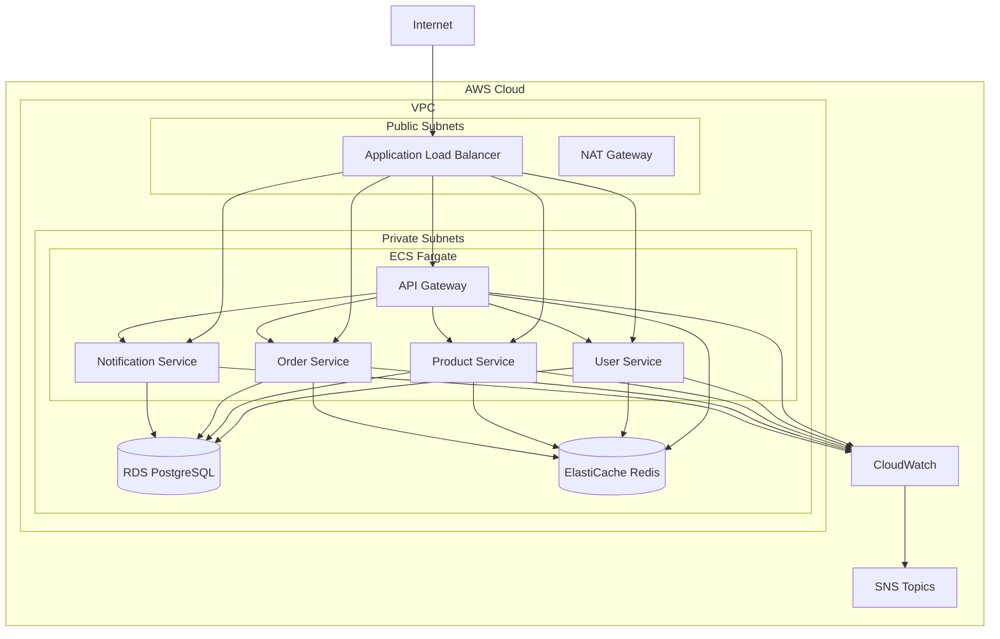

# Phase 1: Kiến Trúc Tổng Thể và Documentation

## 🎯 Mục Tiêu
Thiết lập kiến trúc tổng thể và tạo documentation cho hệ thống Django Microservices trên AWS ECS Fargate.

## 📋 Các Bước Thực Hiện

### 1. Tạo Kiến Trúc Tổng Thể
- ✅ Thiết kế kiến trúc microservices với 5 services:
  - **API Gateway**: Điều phối requests
  - **User Service**: Quản lý người dùng
  - **Product Service**: Quản lý sản phẩm
  - **Order Service**: Xử lý đơn hàng
  - **Notification Service**: Gửi thông báo

### 2. Tạo Cấu Trúc Thư Mục
```
basic-2/
├── terraform/          # Infrastructure as Code
├── microservices/      # Django applications
├── docker/            # Container configurations
├── scripts/           # Automation scripts
├── monitoring/        # Monitoring tools
└── docs/             # Documentation
```

### 3. Tạo Kiến Trúc AWS
- **VPC**: Virtual Private Cloud với Multi-AZ
- **ECS Fargate**: Container orchestration
- **Application Load Balancer**: Traffic distribution
- **RDS PostgreSQL**: Primary database
- **ElastiCache Redis**: Caching layer
- **CloudWatch**: Monitoring và logging

### 4. Tạo Architecture Diagram


### 5. Tạo Documentation
- **ARCHITECTURE.md**: Kiến trúc chi tiết
- **DEPLOYMENT.md**: Hướng dẫn triển khai
- **API.md**: API documentation
- **MONITORING.md**: Monitoring setup

## 🔧 Công Nghệ Sử Dụng

### Backend
- **Django**: Python web framework
- **Django REST Framework**: API development
- **PostgreSQL**: Primary database
- **Redis**: Caching và session storage

### Infrastructure
- **AWS ECS Fargate**: Container orchestration
- **Terraform**: Infrastructure as Code
- **Docker**: Containerization
- **AWS ALB**: Load balancing

### Monitoring
- **CloudWatch**: AWS monitoring
- **SNS**: Notifications
- **Custom dashboards**: Performance tracking

## 📊 Kết Quả Đạt Được

✅ **Kiến trúc hoàn chỉnh** được thiết kế và documented
✅ **Cấu trúc project** được tạo với organization tối ưu
✅ **Technology stack** được xác định và justified
✅ **Documentation** comprehensive cho toàn bộ hệ thống
✅ **Architecture diagram** chi tiết và dễ hiểu

## 🚀 Chuẩn Bị Cho Phase 2

- Infrastructure design hoàn tất
- Technology stack confirmed
- Project structure ready
- Documentation foundation established
- Ready for Terraform implementation

## 📝 Files Tạo Trong Phase 1

- `ARCHITECTURE.md` - Kiến trúc chi tiết
- `basic-2/` - Cấu trúc project
- Architecture diagrams
- Technology decision documents
- Project planning và roadmap

---

**Phase 1 Status**: ✅ **COMPLETED**
**Duration**: ~2 hours  
**Next Phase**: Phase 2 - Setup Infrastructure với Terraform 